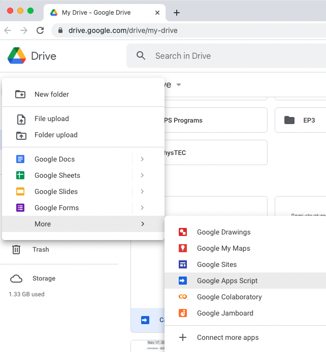
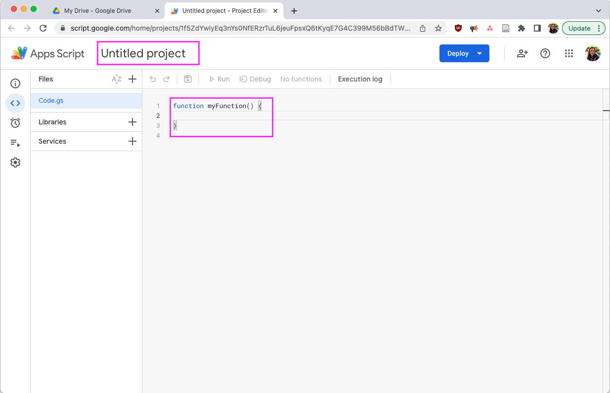

# Google Calendar Sync script
I have a work calendar and a personal calendar. I don't want to put everything into a single calendar, and having to create holds
on my work calendar every time I addded something to my personal calendar was a pain. I tried a few different apps that can sync
calendars, but was never happy - either they only pulled events for the next 2 weeks (and I want to be able to schedule things
further out than that), or they didn't keep everything as private as I wanted. So, I wrote a script based on 
[this blog post](https://janelloi.com/auto-sync-google-calendar/) which uses 
[this script](https://gist.github.com/ttrahan/a88febc0538315b05346f4e3b35997f2).

## What does this script do? What does it not do?
This scripts takes data from a personal/secondary calendar and creates events/holds on a primary/work calendar to block off time 
for personal events and activities. It will also create events for travel/buffer time around events on the personal/secondary
calendar that have a set location that is not a Zoom link.

There are a few limits on the script as written:
* Travel buffer time is a fixed amount of time.
* Currently, all holds and travel buffers on the primary/work calendar REQUIRE the event title from the personal/secondary calendar. Otherwise, the script's methodology for recognizing holds are already present and for deleting holds will not function.
* The script currently ignores locations in the personal/secondary calendar that are Zoom URLs (which is determined by the presence of `.zoom.` in the location text). 
* All events on the secondary/personal calendar will produce a hold on the primary/work calendar. So, if you have 2 events at the same time listed on your secondary calender, there will be 2 holds at the same time on your primary calendar as well.
* The script will try to remove holds if events are removed from the secondary/personal calendar. To do this, the script checks event start/end times and the description (which for travel events is "Travel buffer: [event title]") to confirm if a hold on the primary calendar corresponds to something on your secondary/personal calendar. This means that if the scenario above happens (you have 2 or more events at the same time on your secondary/personal calendar, resulting in multiple holds at the same time on your primary/work calendar), and you delete one of the events from the secondary/personal calendar, it will try to delete the corresponding hold and travel buffers (if present) on the primary/work calendar by matching the time and the event description. However, I would consider this the most tenuous part of the script (i.e., the bit that's most likely to break)

## How to use

Note - if you have multiple personal Google calendars you want to sync, you'll have to repeat the steps below for each calendar.

### A. Set up your personal Google calendar so that it can be synced
1. In your personal calendar, access your [settings](https://calendar.google.com/calendar/u/0/r/settings).
2. Scroll down in the left sidebar and click on the calendar you want to sync.

3. In that calendar's settings, find the "Share with specific people" section, and click on "Add people".
4. Enter your work email and make sure "See all event details" is the permission setting. Click "Send".

5. We'll also need the Calendar ID for the next steps, so scroll through the calendar's settings until you see "Integrate calendar". The first item in that section will be "Calendar ID"; if this is the main calendar for a personal Gmail account, the ID will probably be your email address. Save your ID.

### B. Set up the integration in your work Google calendar
1. Open your work email, which should now have something from Google notifying you that your personal email shared a calendar. Click on the "Add this calendar" link.
2. Open your work Google calendar. You should now see all of your personal calendar events listed in the calendar. If you're the only one looking at your work calendar, this is probably enough. However, in my organization, we often schedule events with other employees by looking at their Google calendars, which only includes their main calendar, and NOT synced calendars. If that's true for you, continue on with these steps.
3. Since we'll be adding events/holds to your main work Google calendar, you should hide the events from your personal calendar (otherwise, everything will show up twice, which can be annoying/overwhelming). Open the left sidebar (click the hamburger menu in the upper left corner if it isn't visible). Scroll down to the "Other calendars" section and uncheck the box next to the name of your personal calendar. I found that I also had to click on the three dots to the right of the calendar name and select "Hide from list" - otherwise, when I reloaded my work calendar, my personal calendar would still show up.

### C. Adding the script to your Google account
1. Open up [My Drive](https://drive.google.com/).
2. In the upper left, click on "New" and click on "More" then "Google Apps Script".

4. Rename the script by clicking on the title "Untitled Project" and rename it something like "Calendar Sync" (or whatever makes the most sense to you - this process does not depend on the script name).
5. You should see `function myFunction()` and some brackets in the main window. Delete all of this text.

7. Copy and paste the script from [my code](https://github.com/caodonnell/COD-GoogleAppScripts/blob/main/GoogleCalendarSync/CalendarSync.gs) into the window. You need to copy everything.
8. **YOU NEED TO ENTER YOUR CALENDAR ID IN LINE 4**. This is the ID you saved from A.5 above when checking out the settings of your personal calendar. **Replace the XXX, but make sure you don't remove the quotation marks or the semicolon at the end of the line.**
9. Press the floppy disk icon to Save the code.
11. Click "Run" to execute the script. Google will ask you for permission to run the script, since it does read and edit your calendar. Please grant it all of the permissions it requires. As the script runs, there will be some output at hte bottom of the screen in the Execution Log. If it completes successfully, the last line in the log should be yellow and say "Execution completed" (you may need to scroll down to see it). Depending on how many days out you want to sync events from your personal calendar and how many events there are to sync, the script might take a minute. If the log ends with a red line and an error message, check that you copied the entire script and entered your calendar ID correctly.

13. Check that everything worked correctly by going through your calendar to see if events and travel buffers appear as expected.

### D. Set up automation so the script will run every time you update your personal calendar
1. In the Apps Script window, click the clock icon on the left sidebar. There should be a "Add trigger" button in the bottom right of the main window. 
2. Click on "Add Trigger".
3. Edit the trigger settings to be the following:
  - Choose which function to run: **sync**
  - Which runs at deployment: **Head** (this should be the default setting)
  - Select event source: **From calendar**
  - Enter calendar details: **Calendar updated** and then enter the **email associated with your personal calendar**
 

### E. Optional: Change settings in the script
Lines 26-42 include a variety of things you can change, including
* Default titles for holds and travel buffers on the primary/work calendar 
* Default text for events with a location (that isn't a Zoom url)
* Set the travel buffer time (DO NOT CHANGE THE `const minsToMilliseconds` in line 31)
* The number of days to sync events from your personal calendar. More days means it'll take more time.
* Whether the script should skip all-day events and/or events on weekends. Note that setting `skipAllDayEvents = false` will only exclude multi-day events if they do not have set start/end times (e.g., something from 3pm on Wednesday through 4pm on Friday will still sync). Whether something occurs on a weekend is determined based on whether *both* the start and end times occurs on weekends. So, if `syncWeekdaysOnly = false`, something that starts on 3pm on Friday and ends on 3pm on Saturday will still sync, as will an event that is 3pm Sunday through 3pm Monday, but an event from 3pm Saturday to 3pm Sunday will *not* sync (since it's entirely over the weekend).
* Whether the primary calendar should have default notifications enabled for holds and travel buffers
* Whether the description for a hold on the primary/work calendar should have some default text (e.g., start with something about "This is a synced event"), or whether the hold description should also include the description from the secondary/personal calendar event. Note that setting `includeDescription = true` means that more information from your personal calendar will be present in your work calendar.
