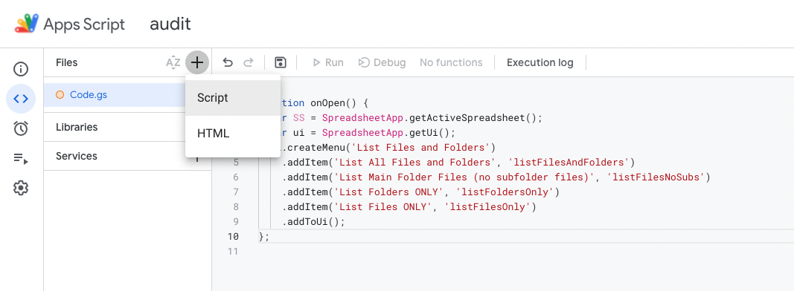

This folder contains the audit script/functions as separate .gs files and is how I actually have my Google Apps Script organized in the audit Google Sheet.
Having the script split across multiple files makes it easier to find things that I want to edit.
You may find this a better setup if you want to edit the code (e.g., you want to adjust what is included in the output, in which case 
```helperFunctions.gs``` contains all that you need to change the header row (```setupSheet()```) and the output (```writeData()```).
If you're looking for something that's more "plug-and-play", I recommend using the version in the 
[folder above](https://github.com/caodonnell/COD-GoogleAppScripts/tree/main/GoogleDriveAudit) rather than digging into these details.

If you're unfamiliar with Google Apps Script: when you have the Apps Script tab open, you can add in additional script files (they all get imported into the Google Sheet when you save/run the code):
> 
