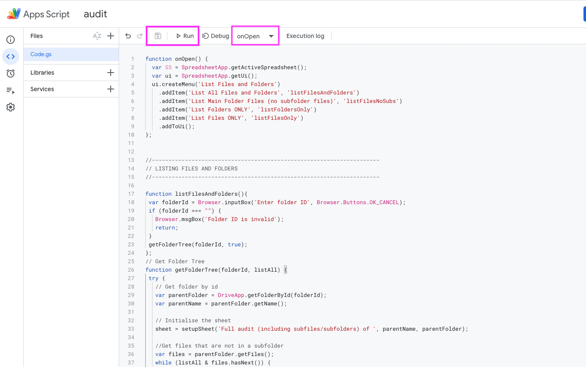

# Google Drive Audit scripts
These functions are designed to audit the files and folders within a Google Drive folder/directory. **A big caveat is that Google Apps Scripts 
may have a short timeout period, which can limit the functionality of these scripts.** If you are in a Google Workspace account (e.g., one
that is owned by an organization, univeristy, etc. so your email doesn't end in ```@gmail.com```), scripts will timeout after 30 minutes.
However, a personal account may timeout after only 6 minutes, so if you have many files, subfiles, and/or subfolders, the script may not be
able to complete auditing your folder. The only workaround I've come up with so far is to audit smaller "chunks" (e.g., instead of doing a 
whole folder, audit the individual subfolders, or even go one level deeper). A better solution may be to use continuation tokens, though I have
not implemented them in my code.
**A second caveat is that this script will only audit files/folders
to which you have at least "View" access.** If there are files/folders within that you don't have access to, they will be ommitted from the output.

## Information included in the file audit

These are the columns that are produced by the audit script:

* **Column A:** File path (from the main folder)
* **Column B:** File/folder name
* **Column C:** Type (e.g., Google Doc, Microsoft Excel, Folder)
* **Column D:** Date the file/folder was created
* **Column E:** Date the file/folder was last updated
* **Column F:** URL to the file/folder
* **Column G:** File/folder ID
* **Column H:** Folder ID of parent folder
* **Column I:** File size (in kb; N/A for folders)
* **Column J:** Email of the file/folder owner (if applicable)
* **Column K:** Emails of file/folder editors (if applicable)
* **Column L:** Emails of file/folder viewers and commenters (if applicable)

## How to implement the script and run an audit

1. Open a new Google Sheet (and give it a name!).

2. Click on **Extensions** and then **Apps Script** in the menu bar.
> 

3. Rename the project, and delete everything that's in the script editing window. 
> 

4. Copy/paste the [audit script](https://github.com/caodonnell/COD-GoogleAppScripts/blob/main/GoogleDriveAudit/AuditScript.gs), making sure to include all of the lines.

      * *Alternate option:* If you expect you'll want to edit the script (e.g., change the output parameters), I recommend importing in the script as a series of files from [this folder](https://github.com/caodonnell/COD-GoogleAppScripts/tree/main/GoogleDriveAudit/IndividualGS). I often put my "main" function (```onOpen()```) in the Code.gs file, and then will add more script files for other functions. The names of the additional script files are not important - Google Sheets will import them all in.
  
 5. Press the "Save" icon (floppy disk), and then press "Run", making sure ```onOpen``` is the selection to the right of "Run". The script will ask for your permission, since it is enabled to access (and modify) your Drive files. Please accept all permissions.
 > 
 
 6. Return to the Google Sheet. There should now be an extra menu item for "List Files and Folders". Select the option that best matches what you want the audit to do:
    * **List All Files and Folders** will list files in the main folder, and it will go into any subfolders to find files there (and into any subsubfolders and so on).
    * **List Main Folder Files (no subfolder files)** will ONLY list the files in the main folder, as well as subfolder names, but it will not search for files (or folders) within the subfolders. This option is especially useful if you have a very big folder that would cause the script to timeout. For example, when I was auditing one of our main project folders with 3000+ files, we used “List Files (no subfolder files)” to audit the files in the main directory. Then, we completed individual runs of “List All Files and Folders” on each of the subfolders. 
    * **List Folders Only** will list all of the folders, subfolders, subsubfolders, and so on, but it will not list any of the files. This option is useful if you want to find out what the whole folder hierarchy looks like.
    * **List Files Only** will list all of the files, including those in subfolders, subsubfolders, and so on.
> 
    
 7. When you select the audit type, you will see a prompt asking you to enter a folder ID for what you want to audit. In a Google Drive folder URL, this is a string of letters, numbers, and characters that uniquely identifies the folder (and does not change if you rename the folder or move it!). In the URL, the ID is the bit that follows “/folders/” but is before any other arguments (e.g., “?usp=sharing” or “?resourcekey=”). For example, when I open a particular folder in my Google Drive, the URL bar shows the following, and the **164Z...TZPZr** bit is the folder ID. Copy and paste your folder ID into the prompt and press "Ok".
 > https\:\/\/drive\.google\.com/drive/folders/**164ZxTiFo4SHp7F_0nmGsxNOUuZTTZPZr**?usp=sharing 
 > 
 
 8. The script will create a new tab/sheet in your Google Sheet workbook named "Audit [Date/Time]". The first row will include the name/URL of the folder it's auditing. The script will have a green dialog as it’s running, and a red one if there’s an error. If you get an error at the start, check your folder ID and ensure you have access to the folder. One potential error is “Maximum time exceeded”, which means the script timed out before it was to complete the audit.
  > 
  > 
 
 9. If the script finishes running (e.g., it doesn’t get an error and it doesn’t time out), the last row will say  ```---FINISHED---```, unless you ran the “List Main Folder Files (no subfolder files)” option, in which case it will say ```---FINISHED WITHOUT GOING INTO SUBFOLDERS---```.
    * Personally, I would recommend deleting that final row and converting the column headers (row 2) into [filters](https://www.howtogeek.com/729347/how-to-filter-in-google-sheets/). But make sure the “FINISHED” message is there; otherwise, something went wrong (e.g., it might have run out of time and not been able to audit all of the files in your folder).
    * Note that files will not be listed in alphabetical order. The first set of rows are for files that are in the main folder (i.e., not in a subfolder). Files that are in the same (sub)folder will be grouped together in adjacent rows.


